# InfotecsTestTask

## Как собрать и запустить приложение:

1. Клонировать репозиторий

```git clone https://github.com/sergeyfedorov02/InfotecsTestTask.git```

2. Перейти в рабочий каталог

```cd InfotecsTestTask```

3. Сделать публикацию для работы web-сервера

```dotnet publish InfotecsTestTask/InfotecsTestTask.csproj -p:PublishProfile=FolderProfile```

4. Перейти в каталог с исполняемым файлом и запустить его

```
cd InfotecsTests\bin\Release\net9.0\publish\
InfotecsTestTask.exe
```

Приложение будет запущено по адресу *http://localhost:5000/*

5. Перейти по указанном адресу и добавить в поисковую строку */swagger* для работы с API

Полный путь для работы/тестирования *http://localhost:5000/swagger*

## Информация о проекте:
1. Предполагается, что локально развернут сервер PostgreSQL. Развернуть можно в Docker,
   используя следующие команды

```
docker pull postgres
docker run -itd -e POSTGRES_USER=admin -e POSTGRES_PASSWORD=admin -p 5432:5432 --name postgresql postgres
```
Имя пользователя и пароль: admin/admin (Такие параметры указаны в строке подключения приложения)

2. Для доступа к базе данных используется Entity Framework и провайдер PostgreSQL. 
При запуске приложения создается база с именем *infotecsDb*, если база с таким именем уже есть, 
то используется она 

3. Юнит тесты реализованы в xUnit и находятся в проекте *InfotecsTests*


## Демонстрация работы

API с тремя методами:

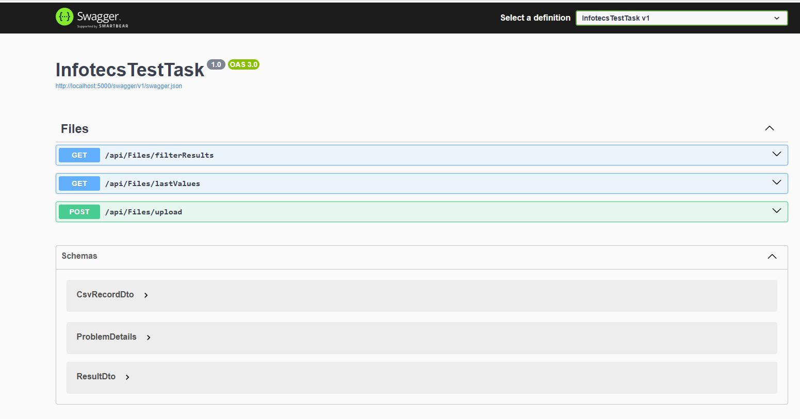

**Первый** метод для загрузки файла csv

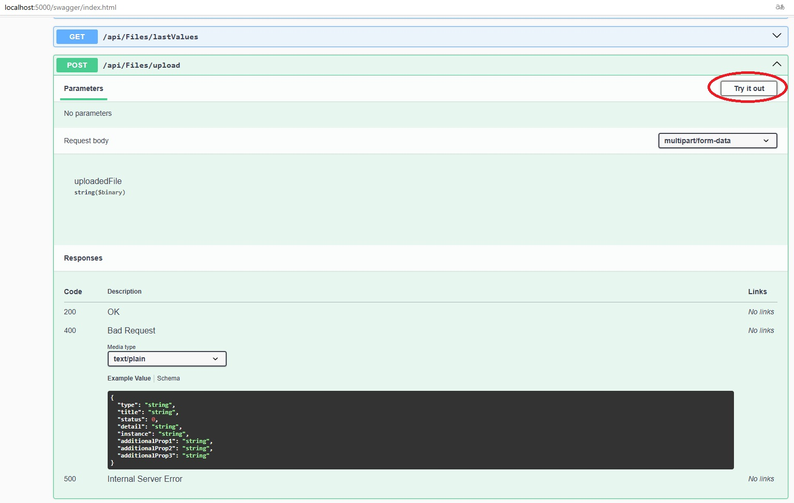

Добавляем файл csv и нажимаем *Execute*

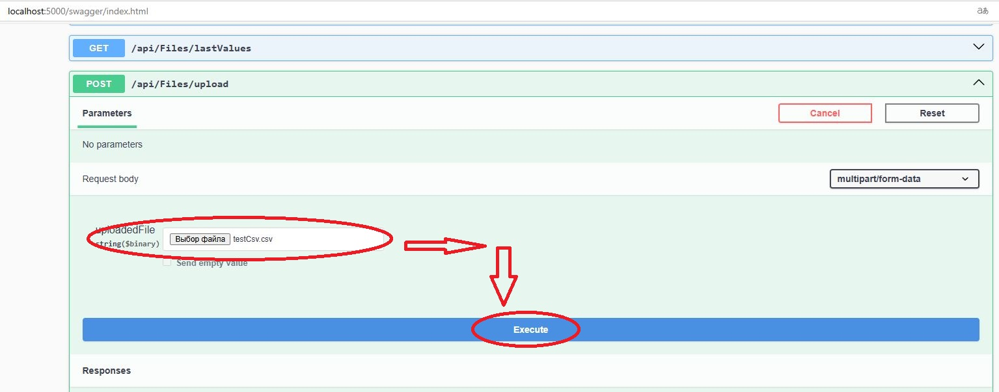

Если файл соответствует заданной структуре CSV, то он будет добавлен

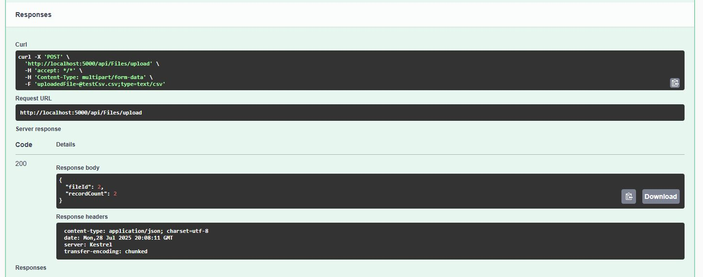

Если файл НЕ соответствует заданной структуре CSV, то он НЕ будет добавлен

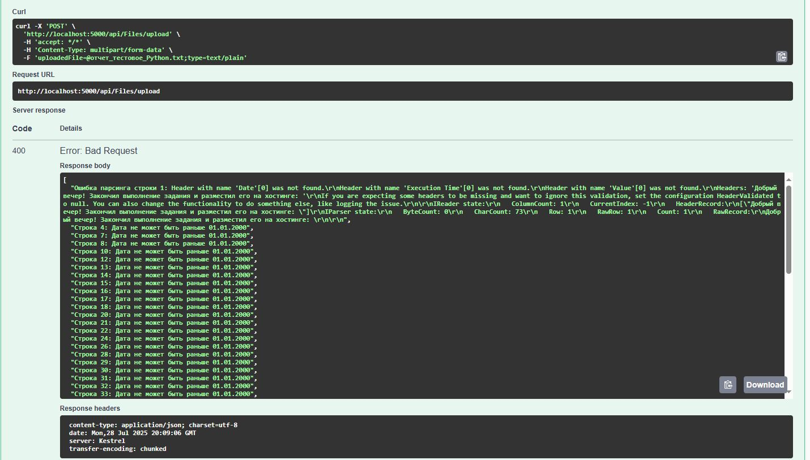

**Второй** метод для получения списка записей из Result, подходящих под фильтры

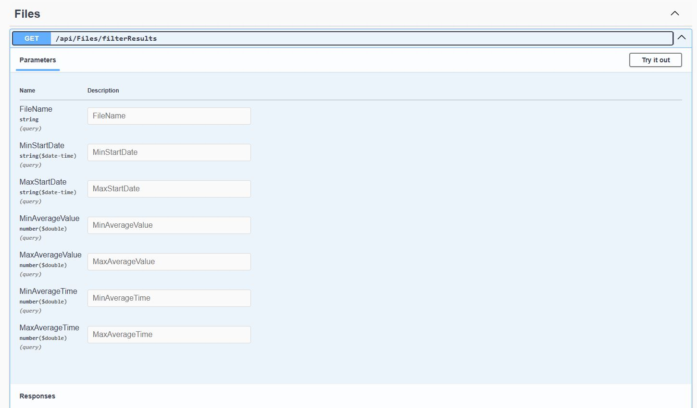

Попробуем применить фильтрацию по имени файла

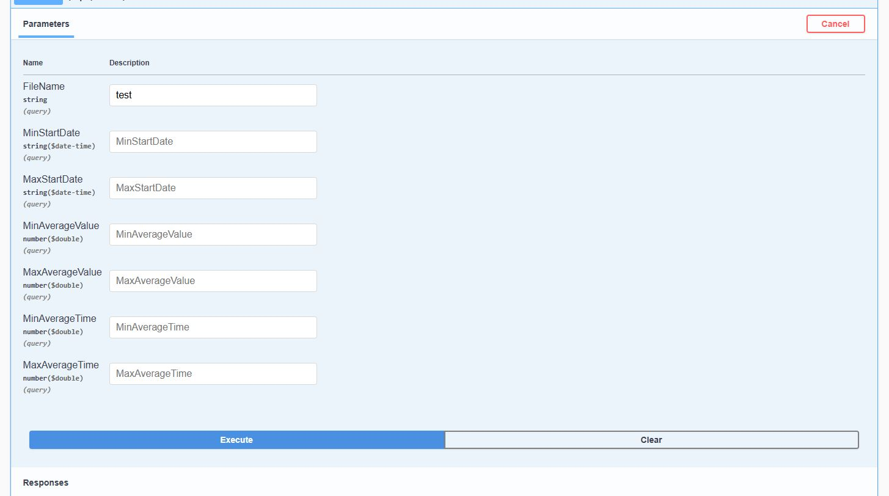

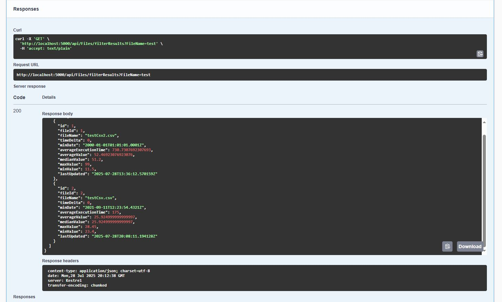

Видно, что было получено 2 файла, теперь введем дополнительную фильтрацию по *MinAverageValue*

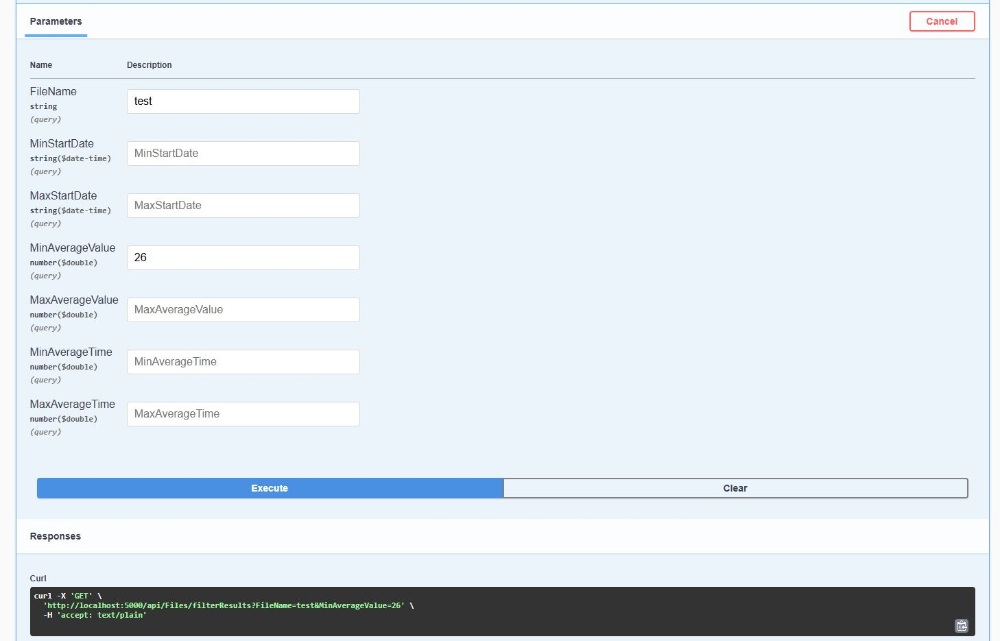

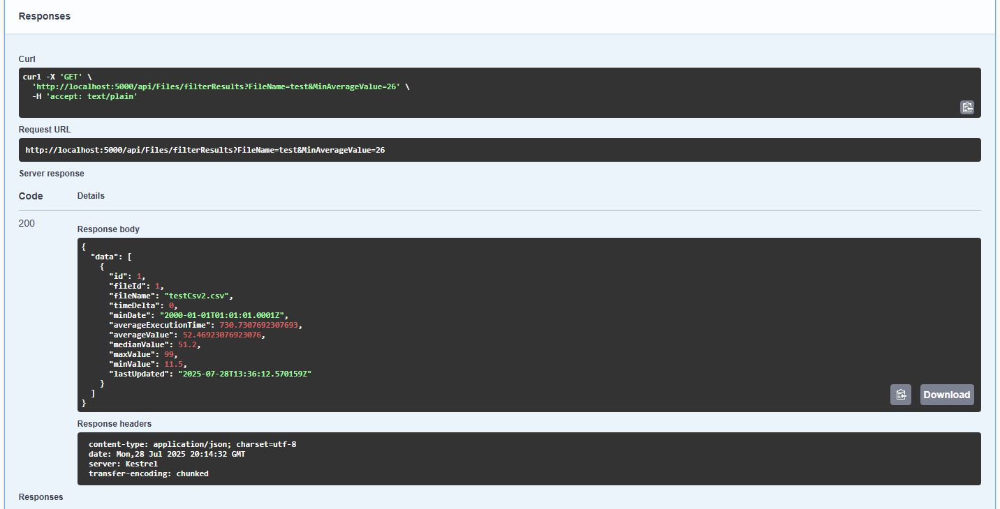

Остался только 1 подходящий результат.

**Третий** метод для получения списка последних 10 значений, отсортированных по начальному времени запуска Date, для заданного файла (по его имени)

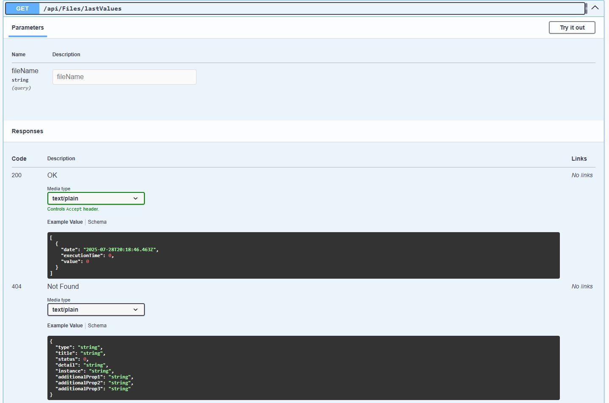

Попробуем найти значения для несуществующего файла -> должны получить соответствующее сообщение об ошибке

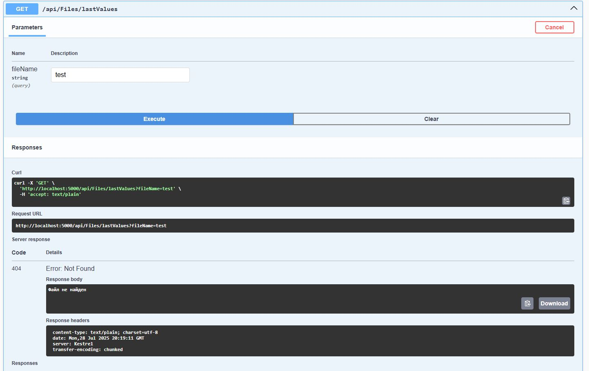

Теперь введем имя добавленного ранее файла -> должны получить значения

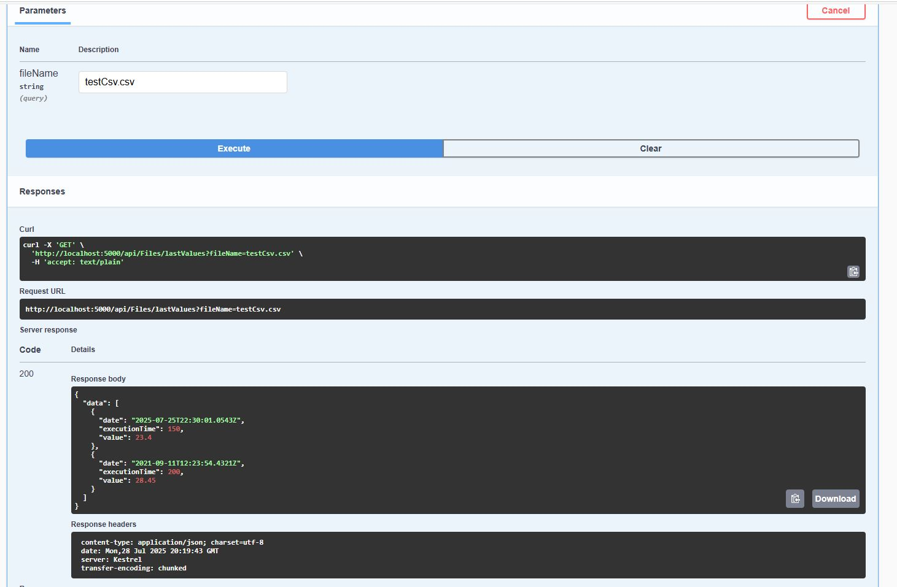